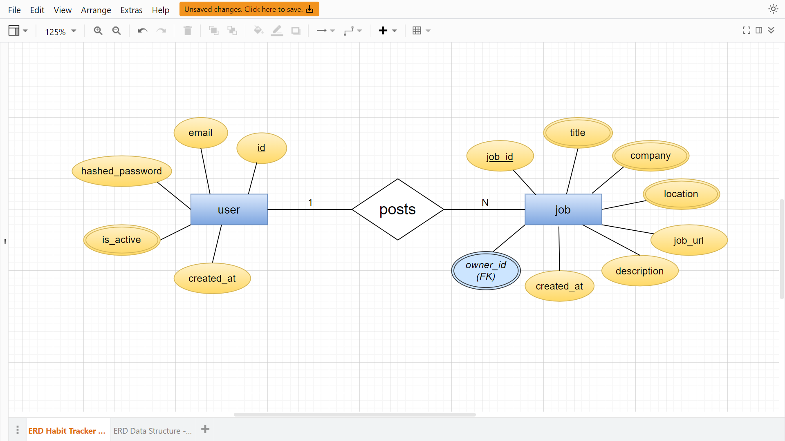

<h1 align="center">
  Jobs.Console: a job API 👽
</h1>

<p align="center"> A job posting console built in FastAPI </p>

<br>

## 🛰 ER Diagram



## 🚀 Tech Stack:
* FastAPI (microframework)
* SQLAlchemy (ORM)
* sqlite (DB)


## 🛠 Installation

### Clone this repo
```
git clone "https://github.com/RhoNit/jobs.Console.git"
```

<hr>

### Navigate to the ```/backend``` sub-directory of the repo
```
cd backend
```

<hr>

### Create a virtual environment
```
python -m venv new-env
```

<hr>

### Activate the virtual environment
```
.\new-env\Scripts\activate     # for Windows

source new-env/bin/activate    # for Linux distros and macOS
```

<hr>

### Install all dependencies mentioned inside ```requirements.txt``` file
```
pip install -r requirements.txt
```

<hr>

### Run the application
```
uvicorn main:app --reload
```

<hr> 

### Visit ```localhost:8000```
```
http://127.0.0.1:8000
```

<hr>

### API Documentation and test APIs on
```
http://127.0.0.1:8000/docs
```


